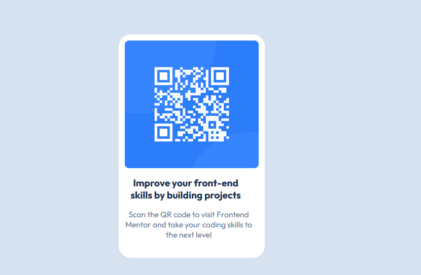

# Frontend Mentor - QR code component solution

This is a solution to the [QR code component challenge on Frontend Mentor](https://www.frontendmentor.io/challenges/qr-code-component-iux_sIO_H). Frontend Mentor challenges help you improve your coding skills by building realistic projects.

## Table of contents

- [Overview](#overview)
- [Screenshot](#screenshot)
- [Links](#links)
- [My process](#my-process)
- [Built with](#built-with)
- [What I learned](#what-i-learned)
- [Continued development](#continued-development)
- [Useful resources](#useful-resources)
- [Author](#author)

**Note: Delete this note and update the table of contents based on what sections you keep.**

## Overview

This project is a challenge to upgrade my skill from frontend mentor, in this challenge i practice layout, flex display as well as properties combinaison to match the given design.

### Screenshot

### Links

- Solution URL: [http://127.0.0.1:5500/frontendmentor/frontendmentor/qr_code_comp/qr-code-component-main/qr-code-component-main/index.html](https://your-solution-url.com)
- Live Site URL: [Add live site URL here](https://your-live-site-url.com)

## My process

To begin with, I have started by drawing the layout using google drawing in order to have a crystal clear idea of the steps to do and then convert them into code. Secondly, I have built the structure of the page with html and finally applied css, starting with default style element and later targeting specific element.

### Built with

- Semantic elements
- div
- CSS custom properties
- Flexbox

### What I learned

In this challenge, the most important thing i learned was trial and error to get the right design. I have also learned useful technique to manage my time like starting with drawing the layout, constructing the structure with html, applying basic styles with css and finally targeting specific class, adding display to position the element on my page to match the design.

### Continued development

I would like to focus on understanding the behavior of properties like (margin, padding, width and heigth) when they are combined with other properties like vertical align, justify-context, align-items. In other words how the combination of display properties and values affect other css properties and values.

### Useful resources

- [Example resource 1](https://www.youtube.com/supersimpledev) - This helped me understand layout, when to use flex and when to use grid as well as positioning element.
  However not many properties and values were covered in the tutorial.

## Author

- Frontend Mentor - [@pentesterjunior](https://www.frontendmentor.io/profile/pentesterjunior)
