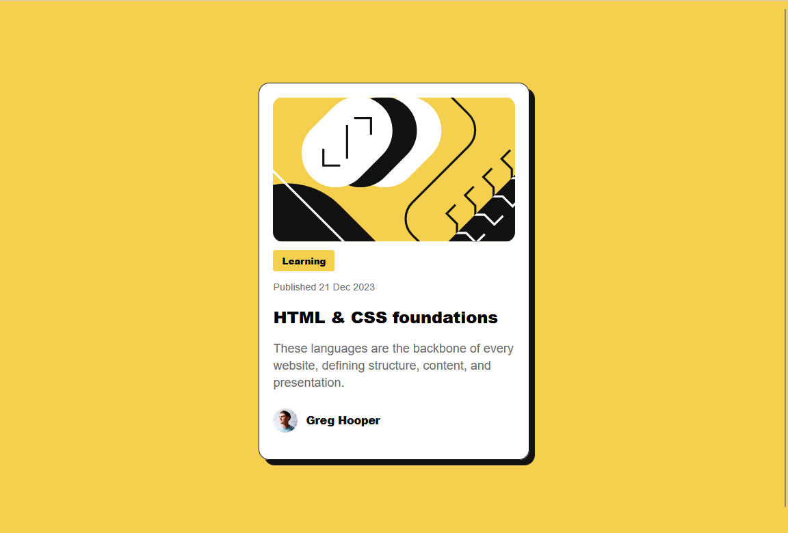

# Frontend Mentor - Blog preview card solution

This is a solution to the [Blog preview card challenge on Frontend Mentor](https://www.frontendmentor.io/challenges/blog-preview-card-ckPaj01IcS). Frontend Mentor challenges help you improve your coding skills by building realistic projects.

## Table of contents

- [Overview](#overview)
- [Screenshot](#screenshot)
- [Links](#links)
- [My process](#my-process)
- [What I learned](#what-i-learned)
- [Continued development](#continued-development)
- [Author](#author)

## Overview

this is my solution to the blog preview card challenge on Frontend Mentor.

### Screenshot

### Links

- Solution URL: http://127.0.0.1:5500/frontend%20mentor/blog-preview-card-main/blog-preview-card-main/index.html
- Live Site URL: [Add live site URL here](https://your-live-site-url.com)

## My process

- Starting by drawing the layout ongoogle drawings
- designing the layout with html
- styling with flexbox and nested flexbox.

### What I learned

In this challenge, i have practice display property along with understanding practically the main axis and cross axis

### Continued development

i would like to focus on layout, display and positioning.

## Author

- Frontend Mentor - [@juniorpentester](https://www.frontendmentor.io/profile/juniorpentester)
- Twitter - [@jeanregis](https://www.twitter.com/jeanregis)
